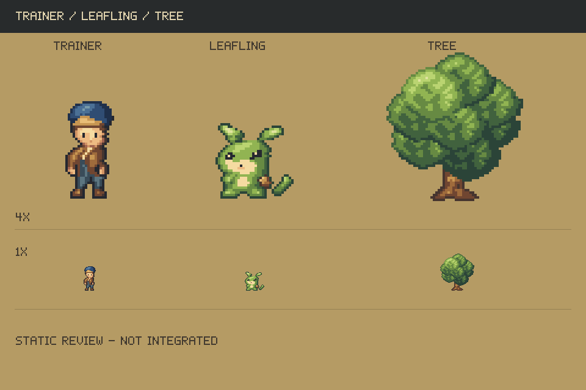

# Pixel Game

A work-in-progress native Godot single-player monster RPG, developed under the
working title **Monster Trail · 새봄의 기록**.

This repository preserves the gameplay source, 200-species design catalog,
development notes, tests, and the latest three pixel-art studies. It is **not a
finished or currently playable game**: previous runtime artwork was removed, and
the replacement studies await review and integration.



## Validation

Python 3 and Godot 4.7.2 are required for the model checks. The engine is not bundled.
Point `GODOT_BIN` at your existing Godot executable:

```sh
GODOT_BIN=/path/to/godot sh tools/check.sh --model-only
```

Validated on 2026-10-08: catalog checks passed; **36/36 model checks passed**.
Visual, integration, and full playthrough checks remain unavailable or incomplete.

## Project notes

Godot 설치형 싱글플레이 몬스터 RPG 개발 프로젝트입니다.

2026-10-08 사용자 요청으로 이전 제작 시각 자료를 전부 삭제했습니다.
웹 튜토리얼과 교정 예제를 조사한 [dote.md](dote.md)가 모든 도트 작업의 필수 기준입니다.
새로 만든 **조련사·잎귀·나무 세 개**는 [직접 검사할 시안](art-reviews/three-subjects-2026-10-08/REVIEW.md)이며,
사용자 승인이나 게임 통합을 마친 상태가 아닙니다. 그래픽 게임 실행은 중단되어 있습니다.

작업 전 [AGENTS.md](AGENTS.md), [HANDOFF.md](HANDOFF.md)를 읽습니다.
시각 작업은 dote.md와 해당 사용자 원본 참고를 실제로 열고 시작합니다.
폐기한 그림·픽셀 배열·생성기를 복원하거나 재사용하지 않습니다.

게임 로직·200종 설계 데이터·저장 기능 코드는 보존했습니다. 본편 완성본이 아닙니다.
`sh tools/check.sh --model-only`는 데이터/모델만 검사하며 화면·통합 플레이 검사를 포함하지 않습니다.
새 아트를 승인받고 연결한 뒤 시각 검사와 실제 플레이 검사를 복구해야 합니다.

로컬 엔진은 기존 Godot 4.7.2. 유료 API·서비스·에셋을 사용하지 않습니다.
Galmuri11과 OFL은 보존했습니다. 코드는 MIT, 아트는 [별도 조건](ASSET_LICENSE.md)입니다.
게임 실행 파일 릴리스는 제공하지 않습니다.

## License and repository contents

Source code and tooling use the [MIT license](LICENSE). Original artwork and game
content have [separate terms](ASSET_LICENSE.md). Galmuri11 is included with its
[SIL Open Font License](assets/fonts/Galmuri-OFL.md); see [third-party notices](THIRD_PARTY_NOTICES.md).

The local Godot engine, generated caches, builds, player saves, and third-party
reference images are excluded. Reference manifests and historical deletion records
are documentation only; their local image paths are not available in this repository.
